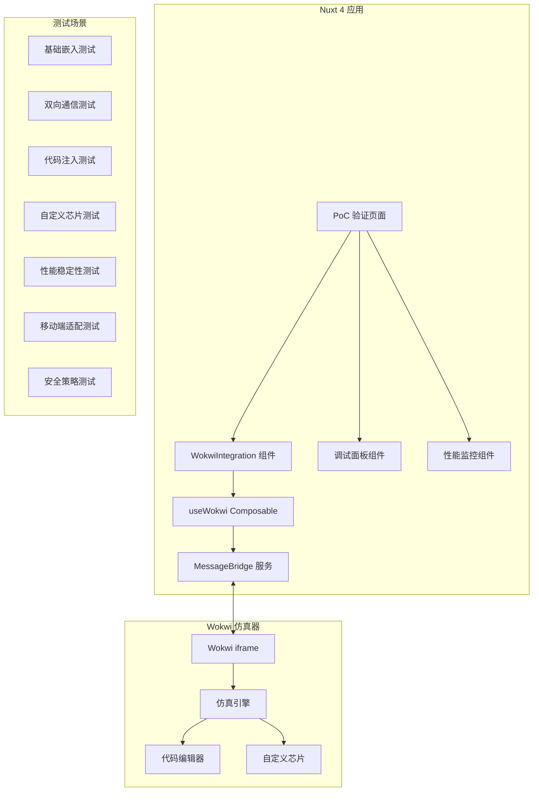

# 设计文档

## 概述

本设计文档描述了 KNZN 硬件学习平台中 Wokwi 仿真器集成验证概念（PoC）的技术实现方案。该 PoC 将创建一个专门的验证页面，全面测试 Wokwi 仿真器在 Nuxt 4 环境中的集成可行性，为后续的完整关卡系统开发提供技术基础和风险评估。

## 架构设计

### 整体架构



### 技术栈选择

- **前端框架**: Nuxt 4 (Vue 3 + TypeScript)
- **通信协议**: postMessage API
- **状态管理**: Vue 3 Composition API + Pinia（如需要）
- **样式框架**: UnoCSS（遵循 KNZN 赛博朋克主题）
- **开发工具**: Vue DevTools + 自定义调试面板

## 组件和接口

### 关键技术实现细节

#### 1. 代码注入机制 (Code Injection)

代码注入是 PoC 验证的关键功能，需要通过 Wokwi 的文件系统 API 实现：

```typescript
// 代码注入的具体实现流程
async function injectCode(filename: string, content: string): Promise<boolean> {
  // 1. 构造 Wokwi 文件更新消息
  const updateMessage = {
    type: 'wokwi:file:update',
    payload: {
      filename, // 'sketch.ino', 'main.py', 'main.cpp'
      content,
      encoding: 'utf-8'
    }
  }
  
  // 2. 发送到 iframe（通过消息队列机制）
  await messageBridge.sendMessage(updateMessage)
  
  // 3. 等待 Wokwi 确认文件更新完成
  return new Promise((resolve) => {
    messageBridge.onMessage('wokwi:file:updated', () => {
      resolve(true)
    })
  })
}
```

#### 2. iframe Ready 状态竞态处理

解决 Nuxt 页面加载与 Wokwi iframe 初始化的时序问题：

```typescript
class MessageBridge {
  private pendingQueue: WokwiMessage[] = []
  private isWokwiReady: boolean = false
  
  // 所有消息都先检查 Ready 状态
  async sendMessage(message: WokwiMessage): Promise<void> {
    if (!this.isWokwiReady) {
      // iframe 未就绪，消息入队等待
      this.pendingQueue.push(message)
      console.log(`消息已入队等待 Wokwi Ready: ${message.type}`)
      return
    }
    
    // iframe 已就绪，立即发送
    return this.sendImmediately(message)
  }
  
  // 监听 Wokwi Ready 信号
  private setupReadyListener(): void {
    window.addEventListener('message', (event) => {
      if (event.data.type === 'wokwi:ready') {
        this.isWokwiReady = true
        console.log('Wokwi iframe 已就绪，开始处理待发送消息')
        this.flushPendingQueue()
      }
    })
  }
  
  // 清空待发送队列
  private flushPendingQueue(): void {
    console.log(`处理 ${this.pendingQueue.length} 条待发送消息`)
    while (this.pendingQueue.length > 0) {
      const message = this.pendingQueue.shift()!
      this.sendImmediately(message)
    }
  }
}
```

#### 3. 自定义芯片通信协议

标准化自定义芯片的事件格式，便于业务层处理：

```typescript
// 自定义芯片事件监听器
function setupCustomChipListener(): void {
  messageBridge.onMessage('wokwi:custom-chip:event', (event: CustomChipEvent) => {
    switch (event.chipId) {
      case 'logic-analyzer-01':
        handleLogicAnalyzerEvent(event)
        break
      case 'signal-generator-01':
        handleSignalGeneratorEvent(event)
        break
      default:
        console.warn(`未知的自定义芯片: ${event.chipId}`)
    }
  })
}

// 逻辑分析仪事件处理（用于判题系统）
function handleLogicAnalyzerEvent(event: CustomChipEvent): void {
  if (event.event === 'signal-pattern-detected') {
    // 检测到特定信号模式，可用于自动判题
    const pattern = event.data.pattern
    const isCorrect = validateSignalPattern(pattern)
    
    // 通知主应用判题结果
    emit('exercise-validation', { isCorrect, pattern })
  }
}
```

### 核心组件设计

#### 1. WokwiIntegration 组件

```typescript
// components/wokwi/WokwiIntegration.client.vue
interface WokwiIntegrationProps {
  projectId?: string
  initialCode?: string
  enableDebug?: boolean
  testMode?: 'basic' | 'communication' | 'injection' | 'custom-chip' | 'performance'
}

interface WokwiState {
  isLoaded: boolean
  isRunning: boolean
  currentProject: string | null
  lastMessage: WokwiMessage | null
  errors: WokwiError[]
  performance: PerformanceMetrics
}
```

#### 2. useWokwi Composable

```typescript
// composables/useWokwi.ts
interface UseWokwiReturn {
  // 状态
  state: Ref<WokwiState>
  isReady: ComputedRef<boolean>
  
  // 方法
  loadProject: (projectId: string) => Promise<void>
  injectCode: (code: string) => Promise<boolean>
  sendMessage: (message: WokwiMessage) => Promise<void>
  startSimulation: () => Promise<void>
  stopSimulation: () => Promise<void>
  resetSimulation: () => Promise<void>
  
  // 事件监听
  onMessage: (callback: (message: WokwiMessage) => void) => void
  onStateChange: (callback: (state: WokwiState) => void) => void
  onError: (callback: (error: WokwiError) => void) => void
}
```

#### 3. MessageBridge 服务

```typescript
// utils/messageBridge.ts
class MessageBridge {
  private iframe: HTMLIFrameElement | null = null
  private messageQueue: WokwiMessage[] = []
  private pendingQueue: WokwiMessage[] = [] // 等待 Wokwi Ready 的消息队列
  private listeners: Map<string, Function[]> = new Map()
  private isWokwiReady: boolean = false
  
  // 初始化通信桥梁
  initialize(iframe: HTMLIFrameElement): void
  
  // 发送消息到 Wokwi（带队列机制）
  sendMessage(message: WokwiMessage): Promise<void> {
    if (!this.isWokwiReady) {
      this.pendingQueue.push(message)
      return Promise.resolve()
    }
    return this.sendImmediately(message)
  }
  
  // 处理 Wokwi Ready 信号
  private onWokwiReady(): void {
    this.isWokwiReady = true
    this.flushPendingQueue()
  }
  
  // 清空待发送队列
  private flushPendingQueue(): void {
    while (this.pendingQueue.length > 0) {
      const message = this.pendingQueue.shift()!
      this.sendImmediately(message)
    }
  }
  
  // 代码注入专用方法
  injectCode(filename: string, content: string): Promise<void> {
    const message: WokwiMessage = {
      type: 'inject-code',
      payload: {
        fileUpdate: {
          filename: filename as 'sketch.ino' | 'main.py' | 'main.cpp',
          content,
          encoding: 'utf-8'
        }
      },
      timestamp: Date.now(),
      id: generateMessageId()
    }
    return this.sendMessage(message)
  }
  
  // 监听来自 Wokwi 的消息
  onMessage(type: string, callback: Function): void
  
  // 验证消息来源安全性
  private validateOrigin(origin: string): boolean
  
  // 处理消息队列
  private processMessageQueue(): void
}
```

### 数据模型

#### WokwiMessage 接口

```typescript
interface WokwiMessage {
  type: 'load-project' | 'inject-code' | 'simulation-control' | 'state-update' | 'custom-chip-event' | 'wokwi-ready'
  payload: {
    projectId?: string
    code?: string
    action?: 'start' | 'stop' | 'reset'
    state?: SimulationState
    chipData?: CustomChipData
    fileUpdate?: WokwiFileUpdate
  }
  timestamp: number
  id: string
}

// 代码注入专用消息格式
interface WokwiFileUpdate {
  filename: 'sketch.ino' | 'main.py' | 'main.cpp'
  content: string
  encoding?: 'utf-8'
}

// 自定义芯片事件标准化格式
interface CustomChipEvent {
  type: 'wokwi:custom-chip:event'
  chipId: string // 例如 "logic-analyzer-01"
  event: string  // 例如 "signal-high", "pin-change"
  data: any      // 芯片特定的数据
  timestamp: number
}

interface SimulationState {
  isRunning: boolean
  runtime: number
  components: ComponentState[]
  serialOutput?: string[]
}

interface CustomChipData {
  chipId: string
  pins: PinState[]
  customEvents: CustomChipEvent[] // 使用标准化的芯片事件格式
}

interface ComponentState {
  id: string
  type: string
  value: any
  pins: PinState[]
}

interface PinState {
  number: number
  value: number | boolean
  mode: 'input' | 'output' | 'analog'
}
```

#### 性能监控数据模型

```typescript
interface PerformanceMetrics {
  loadTime: number
  messageLatency: number[]
  memoryUsage: number
  frameRate: number
  errorCount: number
  uptime: number
}

interface WokwiError {
  type: 'load-error' | 'communication-error' | 'simulation-error' | 'security-error'
  message: string
  timestamp: number
  context?: any
}
```

## 正确性属性

*属性是一个特征或行为，应该在系统的所有有效执行中保持为真——本质上是关于系统应该做什么的正式声明。属性作为人类可读规范和机器可验证正确性保证之间的桥梁。*

基于需求分析，我将为 Wokwi 集成 PoC 定义以下正确性属性：

### 属性 1: Wokwi 仿真器加载和初始化
*对于任何* 有效的项目配置，当 PoC 页面加载时，Wokwi 仿真器应该在 5 秒内成功初始化并显示正确的项目内容
**验证需求: 1.1, 1.2, 5.1**

### 属性 2: 双向通信一致性
*对于任何* 有效的控制指令或状态变化，主应用与 Wokwi 仿真器之间的双向通信应该保持一致性：发送的指令能被正确执行，状态变化能被及时通知
**验证需求: 2.1, 2.2, 3.1, 3.2, 3.3, 3.4**

### 属性 3: 动态代码注入保持功能性
*对于任何* 有效的代码片段，动态注入到 Wokwi 编辑器后，仿真器应该能够重新编译并运行新代码，且不需要页面刷新
**验证需求: 4.6**

### 属性 4: 项目切换状态清理
*对于任何* 项目切换操作，新项目加载时应该完全清除前一个项目的状态，确保状态隔离
**验证需求: 4.1, 4.3, 4.4**

### 属性 5: 自定义芯片事件传递
*对于任何* 包含自定义芯片的项目，当芯片状态发生变化时，相应的 JSON 事件应该能够通过 Message Bridge 正确传递到主应用
**验证需求: 3.6**

### 属性 6: 统一错误处理机制
*对于任何* 类型的错误（加载失败、通信异常、仿真错误），系统应该提供一致的错误处理机制：捕获错误、显示友好提示、提供恢复选项
**验证需求: 1.5, 2.5, 3.5, 4.5**

### 属性 7: 综合性能稳定性
*对于任何* 长时间运行场景，系统应该保持稳定的性能表现：内存使用不持续增长、消息处理延迟保持在合理范围、高频通信不导致系统卡顿
**验证需求: 5.2, 5.3, 5.4**

### 属性 8: 安全通信验证
*对于任何* 通信消息，Message Bridge 应该验证消息来源的合法性、限制数据类型和大小、清理潜在的恶意内容
**验证需求: 7.1, 7.2, 7.3, 7.4**

### 属性 9: 移动端优雅降级
*对于任何* 移动设备访问，系统应该提供优雅的降级体验：检测设备类型、显示适当提示、限制无效交互、保持布局完整性
**验证需求: 6.1, 6.2, 6.3, 6.4**

### 属性 10: 实时状态同步
*对于任何* 仿真状态变化，主应用的 UI 应该实时反映当前状态：运行时间、电路状态、组件状态等信息保持同步更新
**验证需求: 2.3, 2.4**

## 错误处理

### 错误分类和处理策略

#### 1. 加载错误 (Load Errors)
- **iframe 加载失败**: 显示重试按钮，提供备用加载方案
- **项目加载超时**: 5秒超时机制，自动重试最多3次
- **CSP 策略阻止**: 检测并提供解决方案指导

#### 2. 通信错误 (Communication Errors)
- **postMessage 失败**: 实现消息队列和重试机制
- **消息格式错误**: JSON 验证和错误提示
- **超时无响应**: 3秒超时，自动重连

#### 3. 仿真错误 (Simulation Errors)
- **编译错误**: 显示详细错误信息和修复建议
- **运行时错误**: 捕获并显示错误堆栈
- **内存不足**: 提示用户重启仿真器

#### 4. 安全错误 (Security Errors)
- **非法消息来源**: 拒绝处理并记录安全事件
- **恶意输入检测**: 清理输入并警告用户
- **频率限制触发**: 临时限制通信频率

### 错误恢复机制

```typescript
interface ErrorRecoveryStrategy {
  maxRetries: number
  retryDelay: number
  fallbackAction: () => void
  userNotification: string
}

const errorStrategies: Record<string, ErrorRecoveryStrategy> = {
  'load-timeout': {
    maxRetries: 3,
    retryDelay: 2000,
    fallbackAction: () => showOfflineMode(),
    userNotification: '仿真器加载超时，正在重试...'
  },
  'communication-failed': {
    maxRetries: 5,
    retryDelay: 1000,
    fallbackAction: () => reinitializeBridge(),
    userNotification: '通信中断，正在重新连接...'
  }
}
```

## 测试策略

### 双重测试方法

本 PoC 将采用单元测试和属性测试相结合的方法：

- **单元测试**: 验证具体的示例场景、边界条件和错误处理
- **属性测试**: 验证通用属性在各种输入下的正确性
- 两种测试方法互补，确保全面的测试覆盖

### 属性测试配置

- **测试框架**: Vitest + fast-check (JavaScript 属性测试库)
- **最小迭代次数**: 每个属性测试运行 100 次迭代
- **测试标签格式**: **Feature: wokwi-integration-poc, Property {number}: {property_text}**

### 测试场景分类

#### 1. 基础功能测试
- iframe 嵌入和加载
- 基本的用户交互响应
- SSR 兼容性验证

#### 2. 通信协议测试
- postMessage 双向通信
- 消息格式验证
- 错误处理和重试机制

#### 3. 动态功能测试
- 项目动态切换
- 代码动态注入
- 自定义芯片通信

#### 4. 性能和稳定性测试
- 长时间运行稳定性
- 内存泄漏检测
- 高频消息处理

#### 5. 兼容性测试
- 不同浏览器兼容性
- 移动端适配测试
- 生产环境部署验证

#### 6. 安全性测试
- 消息来源验证
- 输入安全清理
- 恶意攻击防护

### 测试数据生成策略

```typescript
// 使用 fast-check 生成测试数据
const projectIdGenerator = fc.string({ minLength: 10, maxLength: 50 })
const codeGenerator = fc.string({ minLength: 50, maxLength: 2000 })
const messageGenerator = fc.record({
  type: fc.constantFrom('load-project', 'inject-code', 'simulation-control'),
  payload: fc.anything(),
  timestamp: fc.integer({ min: 0 }),
  id: fc.uuid()
})
```

### 性能基准

- **页面加载时间**: < 3 秒
- **iframe 初始化时间**: < 5 秒
- **消息传递延迟**: < 100ms
- **项目切换时间**: < 2 秒
- **代码注入响应时间**: < 500ms
- **内存使用增长**: < 10MB/小时

### 测试环境配置

#### 开发环境测试
- 本地 Nuxt 4 开发服务器
- Chrome DevTools 性能监控
- Vue DevTools 状态调试

#### 生产环境测试
- Contabo VPS 部署验证
- HTTPS 证书配置测试
- CDN 加速效果验证

#### 移动端测试
- iOS Safari 兼容性
- Android Chrome 兼容性
- 响应式布局验证

### 测试报告和分析

测试完成后将生成详细的验证报告，包括：

1. **功能验证结果**: 每个需求的验证状态
2. **性能测试数据**: 加载时间、响应延迟、资源使用
3. **兼容性测试矩阵**: 不同浏览器和设备的测试结果
4. **安全测试报告**: 安全漏洞和防护措施验证
5. **风险评估**: 识别的技术风险和建议的缓解措施

这个 PoC 的测试结果将直接指导后续关卡系统的开发决策，确保技术方案的可行性和稳定性。